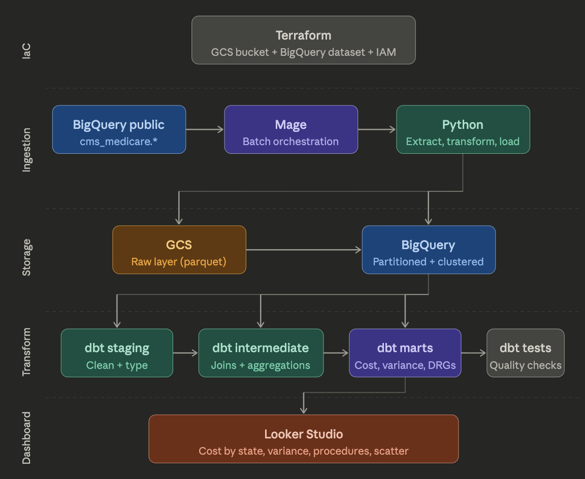
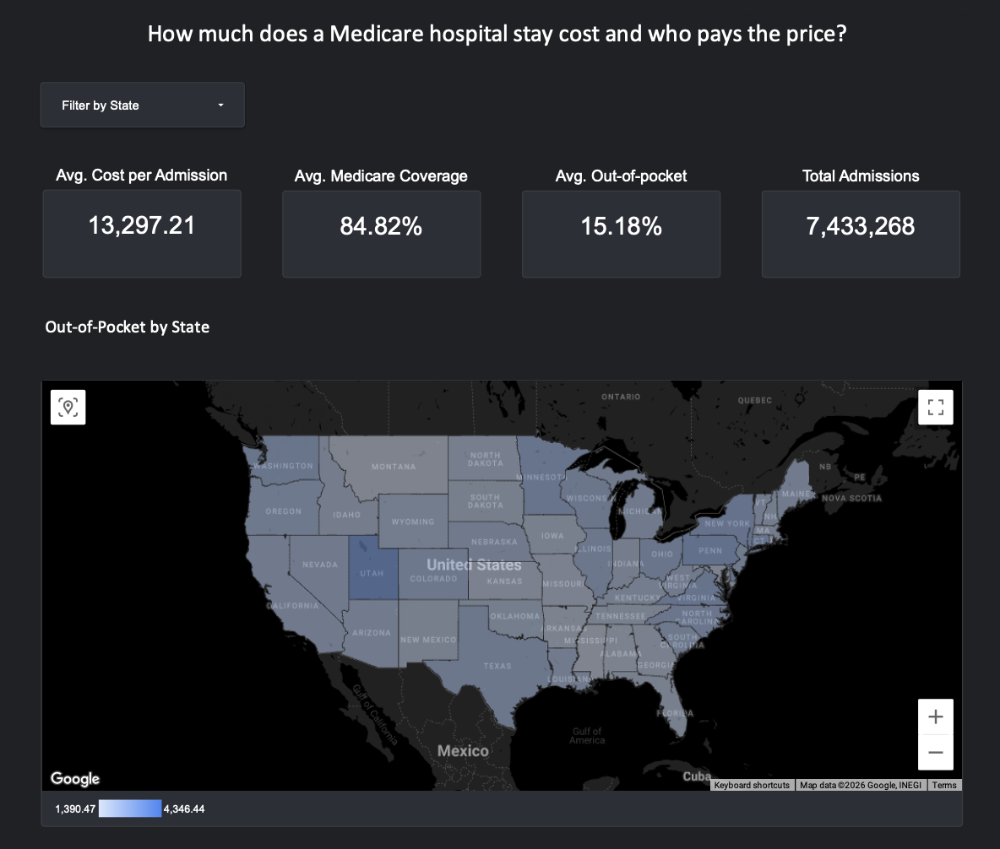

# Medicare Insights Pipeline

This project analyzes U.S. Medicare inpatient charges to answer a simple but important question: when someone is hospitalized, how much does Medicare cover and how much does the patient pay out of pocket?

## Problem

Medicare inpatient data is publicly available but hard to analyze at scale. Raw charge data is spread across thousands of providers and hundreds of procedures, making it difficult to spot geographic and procedural patterns without a proper data pipeline.

This project builds an end-to-end pipeline that ingests, transforms, and visualizes Medicare inpatient data, surfacing cost disparities by state and procedure type.

## Key Findings

- The average Medicare inpatient admission costs ~$13,000, of which Medicare covers ~85% 
  and the patient pays ~15% out of pocket
- DC, Utah, and Hawaii are 58–116% more expensive than the national average out-of-pocket; 
  Montana and Mississippi are ~30% cheaper
- Sepsis and joint replacement dominate admission volumes nationally, 
  but out-of-pocket costs for these procedures vary widely by state
- Most states cluster between $9K–$13K in Medicare payments and $1.5K–$2.5K out-of-pocket, 
  suggesting a relatively consistent national pattern
- DC and Utah are clear outliers — high out-of-pocket costs despite varying Medicare payment levels, 
  suggesting Medicare covers a smaller share of total costs in these states

## Infrastructure

- Cloud — [Google Cloud Platform](https://cloud.google.com)
- Infrastructure as Code — [Terraform](https://www.terraform.io)
- Containerization — [Docker](https://www.docker.com)
- Orchestration — [Mage](https://www.mage.ai)
- Transformation — [dbt](https://www.getdbt.com)
- Data Lake — [Google Cloud Storage](https://cloud.google.com/storage)
- Data Warehouse — [BigQuery](https://cloud.google.com/bigquery)
- Visualization — [Looker Studio](https://lookerstudio.google.com)

<p align="center">
  
</p>

## Dashboard

[Medicare Insights Dashboard](https://lookerstudio.google.com/reporting/779db56a-392f-4ea6-8c1d-678b3b9187ab/page/kqHtF)

<p align="center">
  <a href="https://lookerstudio.google.com/reporting/779db56a-392f-4ea6-8c1d-678b3b9187ab/page/kqHtF">
    
  </a>
</p>

## Setup

### Prerequisites

- [GCP account](https://cloud.google.com) with billing enabled
- [gcloud CLI](https://cloud.google.com/sdk/docs/install) installed and authenticated
- [Terraform](https://developer.hashicorp.com/terraform/install) >= 1.0
- [Docker](https://docs.docker.com/get-docker/)
- [uv](https://github.com/astral-sh/uv)

### 1. Clone the repository
```bash
git clone https://github.com/livsamaral/medicare-insights-pipeline.git
cd medicare-insights-pipeline
```

### 2. Configure GCP
```bash
gcloud config set project medicare-de-project
gcloud services enable iam.googleapis.com bigquery.googleapis.com \
  storage.googleapis.com cloudresourcemanager.googleapis.com
```

### 3. Create service account
```bash
gcloud iam service-accounts create medicare-pipeline-sa \
  --display-name="Medicare Pipeline Service Account"

gcloud projects add-iam-policy-binding medicare-de-project \
  --member="serviceAccount:medicare-pipeline-sa@medicare-de-project.iam.gserviceaccount.com" \
  --role="roles/bigquery.admin"

gcloud projects add-iam-policy-binding medicare-de-project \
  --member="serviceAccount:medicare-pipeline-sa@medicare-de-project.iam.gserviceaccount.com" \
  --role="roles/storage.admin"

mkdir -p ~/.gcp
gcloud iam service-accounts keys create ~/.gcp/medicare-de-project.json \
  --iam-account=medicare-pipeline-sa@medicare-de-project.iam.gserviceaccount.com
```

### 4. Provision infrastructure
```bash
cd terraform
cp terraform.tfvars.example terraform.tfvars
# edit terraform.tfvars with your values
terraform init && terraform apply
```

### 5. Run the pipeline
```bash
cd ../mage
cp .env.example .env
# edit .env with your values
docker compose up
```

Access Mage at `http://localhost:6789` and run the `medicare_ingestion` pipeline.

### 6. Run dbt transformations
```bash
uv venv && source .venv/bin/activate
uv pip install -r requirements.txt
cd medicare_insights
dbt deps && dbt run && dbt test
```

## Further Improvements

- Parametrize pipeline to support multiple Medicare tables (outpatient, physician)
- Add incremental dbt models for year-over-year comparison
- Schedule pipeline with Mage triggers for automated runs
- Add data quality monitoring with dbt alerts

## Acknowledgements

Thanks to [DataTalks.Club](https://datatalks.club) for offering the Data Engineering Zoomcamp free of charge.